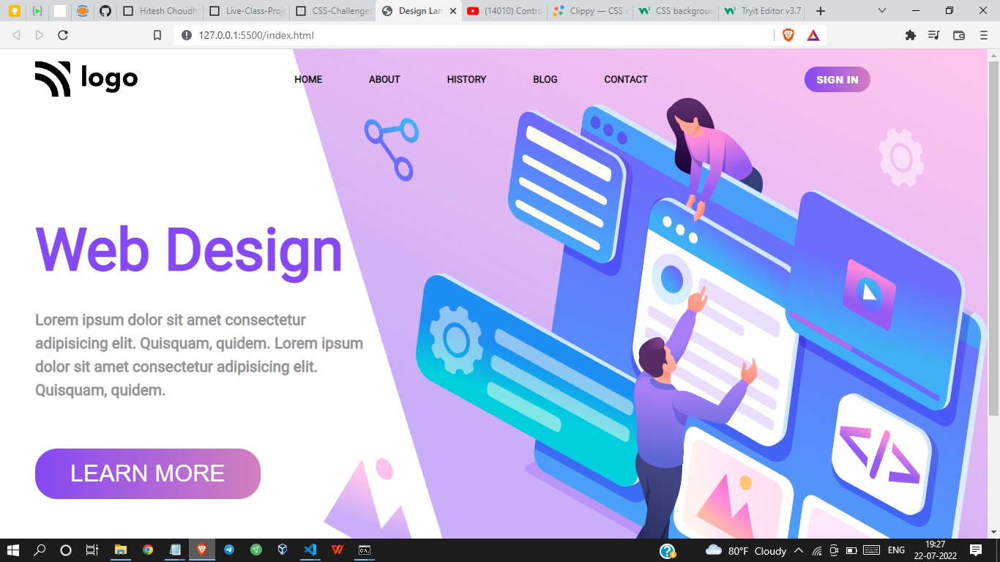

# Project 8 - HTML  and CSS 

By Shreesha

Here's the Live Deployed Website of 

## Project 08  [DEPLOYED LINK](https://project08-web-design-landing-page.netlify.app/)

# What did I learn in this project

- I got to learn about the   positioning of images 
- Got to learn about the flexbox.
- got to learn how to design buttons 
- Also got to play with backgroung images.
- Also learnt about linear gradient.

## Time taken to complete project is 4 hours
